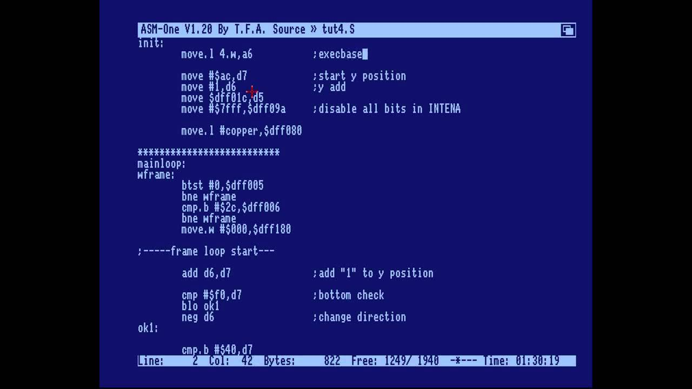
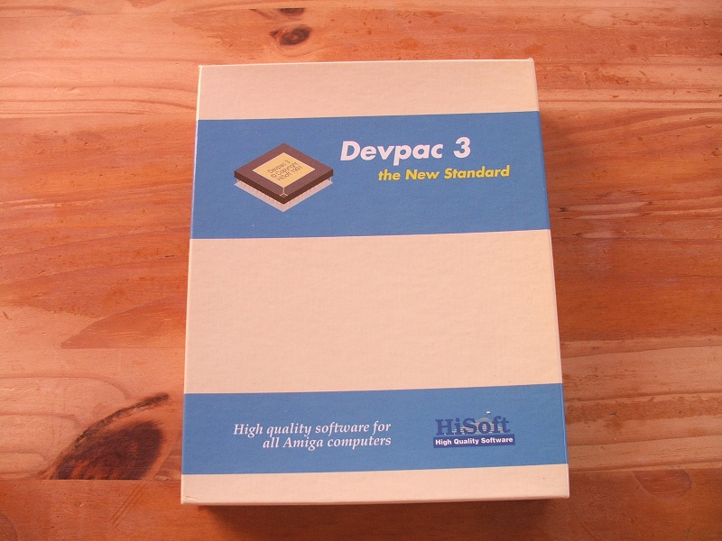
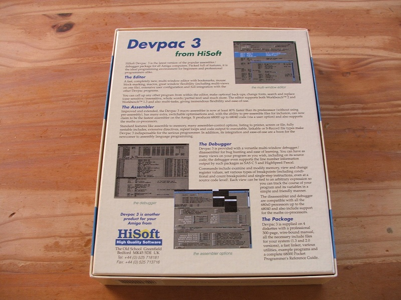
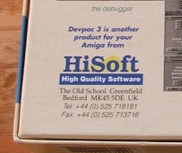
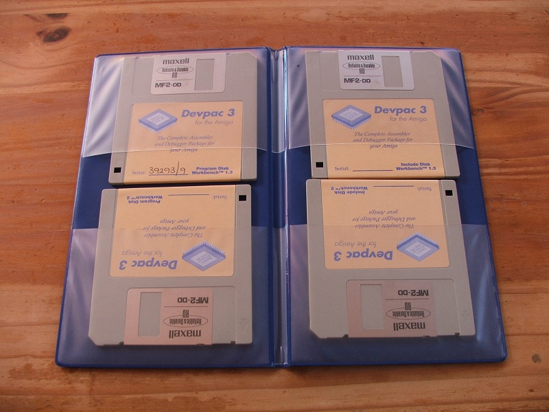
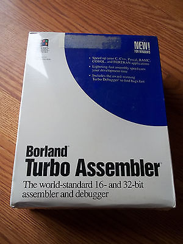
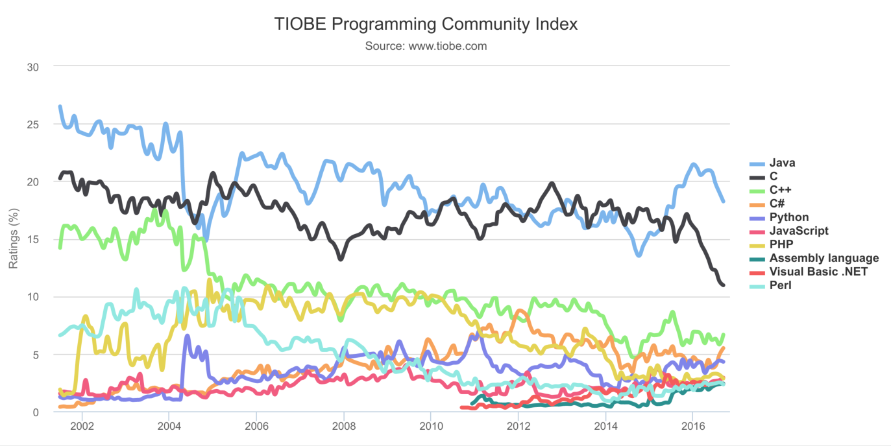

class: center, middle
name: The Search for Simplicity

# The Search for Simplicity
Håkan Råberg

---

### Background
--

1. Worked on a RDF / Semantic web project
--

2. Decided to regain sanity
--

3. By writing a Scheme R7RS compiler in x86-64 assembler
--

4. SEGMENTATION FAULT

---

### History
--

1. Wrote 68k assembler on the Amiga in the early 90s
--

2. Wrote some x86 assembler in the mid 90s
--

3. ... working as a programmer for ~20 years
--

4. What has changed?

---
class: full


---
class: full, top


---
class: full


---
class: full


---
class: full


---
class: full


---
class: full


---
class: full


---
class: center
## *When you think of garbage, think of Akeem*

--
1. [Prince Akeem of Zamunda](http://www.imdb.com/title/tt0094898/)

---

### Akeem Scheme
--

1. [Scheme R7RS small](http://trac.sacrideo.us/wg/raw-attachment/wiki/WikiStart/r7rs.pdf)
--

2. Template-based JIT: code as data
--

3. 5636 LOC x86-64 assembler
--

4. 1611 LOC Scheme
--

5. Uses glibc
--

6. Testing using diff and [entr](http://entrproject.org/)
--

7. TCO, call/cc, varargs, FFI
--

8. Mark and sweep GC
--

9. 2 months full time work

---

### x86-64 Asm
--

1. 16 registers + 16 XMM registers
--

2. CISC, 1-2k instructions
--

3. mov, jmp, add, xor, bts, lea, shl, jle, mulsd, popcnt, comisd, cvtsd2si ...
--

4. Stack grows downwards
--

5. Arguments in rdi, rsi, rdx, rcx, r8, r8 + stack
--

6. Return in rax, rdx
--

7. Calls own rbp, rbx, r12-r15

---
class: raster

#### Register layout
```
64-bit %rax
32-bit                 %eax
16-bit                         %ax
 8-bit                         %ah %al
       |---------------|-------|---|---|

```

---
class: listing

#### Scheme Primitives
```
length:                         # list
        prologue
        assert_arity 1
        assert_tag TAG_PAIR, %rdi, not_a_pair_string
        mov     %rdi, %rax
        xor     %ebx, %ebx

1:      is_nil_internal %rax
        je      2f

        call_scm cdr, %rax
        inc     %rbx
        jmp     1b

2:      box_int_internal %ebx
        return
```

---
class: listing

#### Code as Data
```
        .data

        .align  16
jit_prologue:
        push    %rbp
        mov     %rsp, %rbp
        sub     $0x11223344, %rsp
jit_prologue_size:
        .quad   (. - jit_prologue)

        .align  16
jit_epilogue:
        mov     %rbp, %rsp
        pop     %rbp
jit_epilogue_size:
        .quad   (. - jit_epilogue)
```

---
class: list-listing

### Code Gen
--

1. (lambda (x)
       (+ 2 x))

---
class: raster

##### Store caller frame

```
00:	push   %rbp
```

--

##### Establish new frame

```
01:	mov    %rsp,%rbp
```

--

##### Allocate 8 bytes for x (rounded to 16)

```
04:	sub    $0x10,%rsp
```

---
class: listing

#### Stack frame layout
```
^                            ^ higher
|                            |
|      (previous frame)      |
|-----------|----------------|
| %rbp + 8  | return address |
|-----------|----------------|
| %rbp      | saved %rbp     | <- %rbp  . (current frame)
|-----------|----------------|          .
| %rbp - 8  | x, from %rdi   |          .
| %rbp - 16 | (padding)      | <- %rsp  .
|-----------|----------------|
|         (red zone)         |
:                            :
.                            . lower
```

---
class: raster

##### Expected arity is 1
```
0b:	movabs $0x1,%r10
```

--

##### Did caller provide correct arity?
```
15:	cmp    %r10b,%al
18:	je     0x24
```

--

##### Throw arity error
```
1a:	mov    $0x40e7ab,%r11
21:	callq  *%r11
```

---
class: raster

##### First argument as local x
```
24:	mov    %rdi,-0x8(%rbp)
```

--

##### x as second argument to +
```
2b:	mov    -0x8(%rbp),%rsi
```

--

##### 2 with tag as first argument to +
```
32:	movabs $0x7ff8800000000002,%rdi
```

---
class: raster

#### Tag layout

```
   $0x7ff8000000000000  NaN
   $0x0000800000000000  32-bit integer tag
 + $0x0000000000000002  value
----------------------
   $0x7ff8800000000002  tagged Scheme value

```

---
class: raster

##### Clear multiple returns
```
3c:	xor    %edx,%edx
```

---
class: raster

##### Symbol + id with tag
```
3e:	movabs $0x7ff9000000000060,%rax
```

--

##### Value of + in the symbol table
```
48:	mov    0x627120(,%eax,8),%r10
```

--

##### () with tag
```
51:	movabs $0x7fff000000000000,%r11
```

---
class: raster

##### Is the value of + null?
```
5b:	cmp    %r10,%r11
5e:	jne    0x6d
```

--

##### Throw symbol not defined, id as first argument
```
60:	mov    $0x40e5e3,%r11
67:	mov    %rax,%rdi
6a:	callq  *%r11
```

---
class: raster

##### + is defined
```
6d:	mov    %r10,%rax
```

--

##### Remove tag by shifting
```
70:	mov    %rax,%r11
73:	shl    $0x10,%r11
77:	shr    $0x10,%r11
```

---
class: raster

##### Set number of arguments
```
7b:	xor    %eax,%eax
7d:	mov    $0x2,%al
```

--

##### Restore stack and frame for TCO
```
7f:	mov    %rbp,%rsp
82:	pop    %rbp
```

--

##### Tail call to +
```
83:	jmpq   *%r11
```

---
class: raster

##### Normal epilogue, never reached
```
86:	mov    %rbp,%rsp
89:	pop    %rbp
8a:	retq
```

---
class: small-listing, listing

##### Recap (lambda (x) (+ 2 x))
```
00:	push   %rbp                           # Prologue
01:	mov    %rsp,%rbp
04:	sub    $0x10,%rsp
0b:	movabs $0x1,%r10                      # Arity check
15:	cmp    %r10b,%al
18:	je     0x24
1a:	mov    $0x40e7ab,%r11                 # Arity error
21:	callq  *%r11
24:	mov    %rdi,-0x8(%rbp)                # Store argument x
2b:	mov    -0x8(%rbp),%rsi                # x as argument 2 of +
32:	movabs $0x7ff8800000000002,%rdi       # 2 as argument 1 of +
3c:	xor    %edx,%edx
3e:	movabs $0x7ff9000000000060,%rax       # Load value of +
48:	mov    0x627120(,%eax,8),%r10
51:	movabs $0x7fff000000000000,%r11       # Check for null?
5b:	cmp    %r10,%r11
5e:	jne    0x6d
60:	mov    $0x40e5e3,%r11                 # Symbol not defined
67:	mov    %rax,%rdi
6a:	callq  *%r11
6d:	mov    %r10,%rax                      # Remove tag for call
70:	mov    %rax,%r11
73:	shl    $0x10,%r11
77:	shr    $0x10,%r11
7b:	xor    %eax,%eax                      # Set number of arguments
7d:	mov    $0x2,%al
7f:	mov    %rbp,%rsp                      # Restore stack for TCO
82:	pop    %rbp
83:	jmpq   *%r11                          # Tail call to +
86:	mov    %rbp,%rsp                      # Dead code
89:	pop    %rbp
8a:	retq
```

---

### Reflection
--

1. Closeness to hardware mainly an illusion
--

2. Strictness about im/mutability extremely important
--

3. Patterns and conventional register use key
--

4. Testing is fundamental
--

5. Keep a few layers clean and simple
--

6. Cut losses and throw away changes
--

7. Commit all the time

---
1. (simple?)

--
2. \#f

---
class: center, middle

#### [github.com/hraberg/akeem](https://github.com/hraberg/akeem)

---
class: center, middle

## Extra Slides

---
class: listing

#### Assembler Macros
```
        .macro box_int_internal value=%eax, tmp=%r11
        mov     \value, %eax
        tag     TAG_INT, %rax, %rax, \tmp
        .endm

        .macro tag tag value=%rax, target=%rax, tmp=%r11
        mov_reg \value, \target
        mov     $(NAN_MASK | \tag << TAG_SHIFT), \tmp
        or      \tmp, \target
        .endm

        .macro cdr from, to=%rax
        unbox_pointer_internal \from \to
        mov     pair_cdr(\to), \to
        .endm
```

---
class: listing

#### NaN Boxing
```
        .equ NAN_MASK, 0x7FF8000000000000
        .equ TAG_SHIFT, 45
        .equ TAG_MASK, (1 << 6) - 1
        .equ POINTER_TAG_MASK, ~(TAG_SYMBOL - 1)

        .equ TAG_DOUBLE, 0

        .equ TAG_BOOLEAN, 1
        .equ TAG_BYTE, 2
        .equ TAG_CHAR, 3
        .equ TAG_INT, 4

        .equ TAG_SYMBOL, 8
        ...
```

---
class: listing

#### Tagging
```
        .macro extract_tag from=%rdi
        is_double_internal \from, store=false
        mov     $TAG_DOUBLE, %eax
        cmovg   \from, %rax
        shr     $TAG_SHIFT, %rax
        and     $TAG_MASK, %eax
        mov     $POINTER_TAG_MASK, %r11b
        mov     $TAG_MASK, %r9b
        test    %r11b, %al
        cmovnz  %r11w, %r9w
        and     %r9b, %al
        .endm
```

---
class: listing

#### boot.scm
```
;;; R7RS Boot

;;; 4. Expressions

;;; 4.2. Derived expression types

;;; 4.2.1. Conditionals

(define-syntax and
  (lambda (form env)
    (append (cons 'if (cdr form)) '(#f))))

(define-syntax or
  (lambda (form env)
    (let ((form (cdr form)))
      (cons 'if (cons (car form) (cons #t (cdr form)))))))

```

---
class: listing

#### r7rs.scm

```
(define-syntax and
  (syntax-rules ()
    ((and) #t)
    ((and test) test)
    ((and test1 test2 ...)
     (if test1 (and test2 ...) #f))))

(define-syntax or
  (syntax-rules ()
    ((or) #f)
    ((or test) test)
    ((or test1 test2 ...)
     (let ((x test1))
       (if x x (or test2 ...))))))
```
